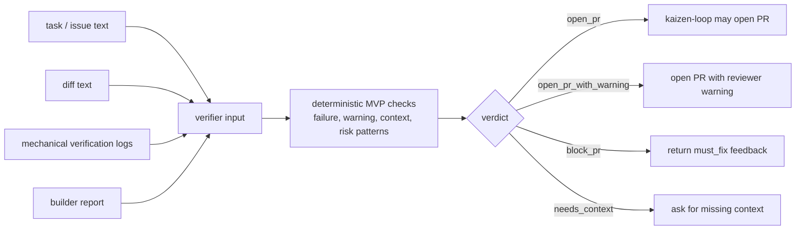
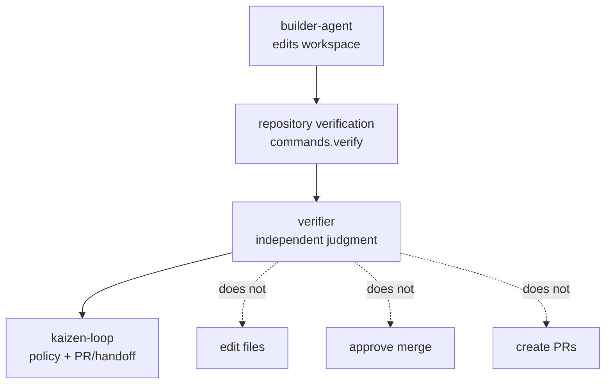

# Verifier

`verifier` is the independent quality gate for Kaizen Agents. It evaluates task context, diff text, mechanical verification logs, and builder output, then returns a small JSON verdict that `kaizen-loop` can use before opening a pull request.

The current implementation is an MVP gate. The full staged verifier described in [docs/SPEC.md](./docs/SPEC.md) and [docs/DESIGN.md](./docs/DESIGN.md) is the roadmap; the MVP provides the stable executable contract that the orchestrator can call today.

## Gate Flow



## Role In Kaizen Agents



## Current Package

The runnable CLI lives in `packages/core` and is exposed as `verifier` after build.

```sh
pnpm install
pnpm typecheck
pnpm test
pnpm schema:check
```

Useful package commands:

| Command | Purpose |
|---|---|
| `pnpm typecheck` | Type-check the workspace. |
| `pnpm test` | Run Vitest tests. |
| `pnpm schema:generate` | Regenerate `schemas/verdict.schema.json` from Zod types. |
| `pnpm schema:check` | Regenerate the schema and fail if the committed schema is stale. |

## CLI Usage

Check installation:

```sh
node packages/core/dist/cli.js --version
```

Run the canonical check command with files:

```sh
node packages/core/dist/cli.js check \
  --task-file task.md \
  --diff-file diff.patch \
  --verify-logs-file verify.log \
  --builder-report-file builder-report.md \
  --pretty
```

Inline values are also supported:

```sh
node packages/core/dist/cli.js check \
  --task "Add signup validation" \
  --diff "diff --git a/signup.ts b/signup.ts ..." \
  --verify-logs "all tests passed" \
  --builder-report "build successful" \
  --pretty
```

`verifier check` is the canonical command. `verifier verdict` and bare options are accepted for compatibility.

The CLI always writes JSON to stdout and exits:

- `0` for a completed judgment, including blocking judgments.
- `2` for usage or runtime errors.

## MVP Verdict Model

The current JSON contract is:

```json
{
  "schemaVersion": 1,
  "verdict": "open_pr",
  "must_fix": [],
  "should_fix": [],
  "confidence": 82,
  "risk": "low",
  "summary": "Open PR with 0 should_fix item(s); risk is low."
}
```

`verdict` is one of:

| Verdict | Meaning |
|---|---|
| `open_pr` | Task and diff context exist, and no blocking or warning signal was found. |
| `open_pr_with_warning` | No blocking signal was found, but reviewers should see non-blocking risk signals. |
| `block_pr` | Verification logs or builder report contain blocking failure signals. |
| `needs_context` | Task or diff context is missing, so the change cannot be checked against intent. |

The MVP heuristic intentionally stays small and deterministic:

- hard failure patterns in verification logs or builder reports become `must_fix`;
- warnings, skipped/flaky/todo/risk/manual-review signals become `should_fix`;
- missing task, diff, logs, or builder report lowers confidence and may require context;
- high-risk diff terms such as auth, secrets, billing, migration, delete, or database operations add a warning unless covered by stronger evidence.

## Kaizen Loop Integration

When `kaizen-loop` invokes `verifier`, it calls the command with no arguments, passes a verifier prompt on stdin, and expects a compact payload at `KAIZEN_VERIFIER_RESULT_PATH`.

```sh
KAIZEN_VERIFIER_RESULT_PATH=.kaizen/verifier/verify-result.json \
KAIZEN_WORKSPACE_DIR="$PWD" \
verifier < prompt.txt
```

The integration payload is:

```json
{
  "status": "open_pr",
  "summary": "Open PR with 0 should_fix item(s); risk is low.",
  "notes": "risk=low\nconfidence=82",
  "reason": ""
}
```

`status` is one of `open_pr`, `open_pr_with_warning`, `block_pr`, or `needs_context`.

`verifier` does not edit files, create branches, commit changes, create pull requests, or grant merge approval. It returns an independent gate decision for the orchestrator and human reviewers.

## Full Verifier Roadmap

The longer-term design is documented but not fully implemented:

- [docs/SPEC.md](./docs/SPEC.md): product concept, staged verification pipeline, verdict semantics, and intended interfaces.
- [docs/DESIGN.md](./docs/DESIGN.md): component architecture, data model, severity rules, evidence store, and probe driver design.
- [docs/EVAL.md](./docs/EVAL.md): benchmark corpus, fixture apps, metrics, and release gates for verifier quality.

Future staged flags such as `--base`, `--pr`, `--intent`, `--stages`, and `--reuse-claims` are reserved by the public spec. The current MVP rejects them with a clear error and expects explicit task/diff/log/report inputs instead.
