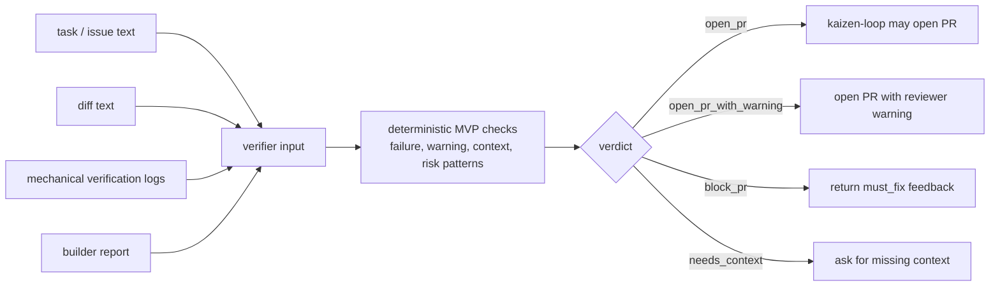
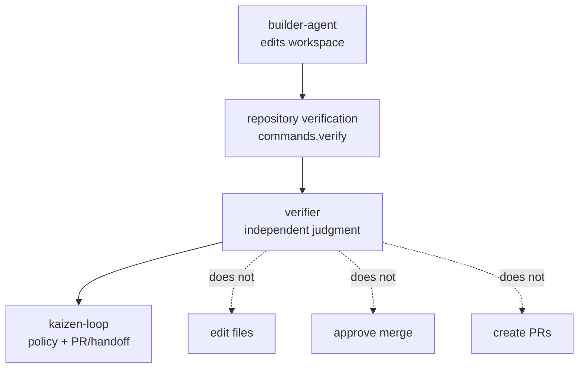

# Verifier

`verifier` is the independent quality gate for Kaizen Agents. It evaluates task
context, diff text, mechanical verification logs, and builder output, then
returns a small JSON verdict that `kaizen-loop` can use before opening a pull
request.

The current implementation is an MVP gate. The full staged verifier described in
[docs/SPEC.md](./docs/SPEC.md) and [docs/DESIGN.md](./docs/DESIGN.md) is the
roadmap; the MVP provides the stable executable contract that the orchestrator
can call today, plus a local workspace check that records run evidence.

## Gate Flow



## Role In Kaizen Agents



## Current Package

The runnable CLI lives in `packages/core` and is exposed as `verifier` after
build.

```sh
pnpm install
pnpm typecheck
pnpm test
pnpm build
pnpm test:built-cli
pnpm schema:check
```

Useful package commands:

| Command | Purpose |
|---|---|
| `pnpm typecheck` | Type-check the workspace. |
| `pnpm test` | Run Vitest tests. |
| `pnpm build` | Build the CLI and embed its source commit in `dist/build-info.json`. |
| `pnpm test:built-cli` | Exercise the built CLI, including provenance and ANSI-log regressions. |
| `pnpm eval` | Run the committed verifier eval corpus and print metrics. |
| `pnpm eval:fixtures` | Run the hermetic repository-fixture baseline and update `fixtures/metrics.json`. |
| `pnpm eval:semantic -- --mode smoke` | Replay sb-001/003/008 with refutation on and off. |
| `pnpm eval:semantic -- --mode full --output fixtures/semantic-metrics.json` | Replay the full semantic corpus and enforce `eval/thresholds.json`. |
| `pnpm schema:generate` | Regenerate `schemas/verdict.schema.json` from Zod types. |
| `pnpm schema:check` | Regenerate the schema and fail if the committed schema is stale. |

## Opt-in Intent Extraction

`packages/agents` exposes the first opt-in LLM stage. It calls the Claude Messages
API directly with structured Zod output, converts the result into deterministic
core `Claim` values, applies the synthetic C-0 rule, records usage in `RunMeta`,
and writes `.verifier/runs/<run-id>/claims.json`.

```ts
import { runIntentStage } from "@verifier/agents";

const stage0 = await runIntentStage(
  {
    sources: [
      {
        source: { tier: "primary", kind: "issue", ref: issueUrl },
        content: issueBody
      }
    ],
    diffSummary
  },
  runMeta
);
```

The default transport reads `ANTHROPIC_API_KEY` through `@anthropic-ai/sdk`.
Callers can inject a transport for tests or controlled execution. The existing
`verifier check` CLI does not import or invoke this package and remains fully
deterministic and network-free.

## Opt-in Correctness Review And Refutation

`@verifier/agents` also exposes one correctness lens plus an adversarial
refuter. Both use strict structured outputs. The lens requires a concrete
`scenario` and contains no `severity`; core derives severity. The refuter can
propose a `reproCommand`, but only `runRefutationStage` passes that string to
the bounded core executor after a caller-supplied `authorizeCommand` approves
that exact command, then records redacted command evidence. Production callers
remain responsible for applying their sandbox and side-effect policy.

The semantic eval replays committed lens/refuter outputs for all 14 repository
fixtures, so CI needs no API key or billable network call. Its comparison is
stored in `fixtures/semantic-metrics.json`. Normal changes run the smoke subset;
agent, judge, refutation, prompt, and threshold changes run the full gate.
Batch submission is available through the injected `submitSemanticEvalBatch`
boundary and is never called by CI.

## Opt-in Runtime Probes

`@verifier/probe-sdk` exposes the dependency-free Probe Driver contract from
`docs/DESIGN.md` §6. Bundled `@verifier/probe-driver-cli` and
`@verifier/probe-driver-api` packages execute CLI and loopback HTTP scenarios;
drivers return observations only. `@verifier/agents` owns scenario generation,
expected-result comparison, runtime Evidence/Finding creation, and the shared
refutation-gate handoff.

Generated CLI steps name caller-registered command IDs, which are resolved to
fixed executable/argument arrays and spawned without a shell. API steps are
restricted to relative paths on a caller-authorized host; redirects are not
followed. The default `verifier check` CLI does not enable Stage 5 yet, and
production callers remain responsible for sandboxing target code.

## CLI Usage

Check installation:

```sh
node packages/core/dist/cli.js --version
```

For machine-readable build provenance and stale-link detection, use:

```sh
node packages/core/dist/cli.js --version --json
```

Linked development installations report `status: "stale"` when the source
checkout HEAD no longer matches the commit embedded by `pnpm build`. Rebuild
before linking or running scheduled automation:

```sh
pnpm install --frozen-lockfile
pnpm build
pnpm test:built-cli
pnpm --filter @verifier/core link --global
verifier --version --json
```

Run the canonical contract check with files:

```sh
node packages/core/dist/cli.js check \
  --task-file task.md \
  --diff-file diff.patch \
  --verify-logs-file verify.log \
  --builder-report-file builder-report.md \
  --pretty
```

Inline values are also supported:

```sh
node packages/core/dist/cli.js check \
  --task "Add signup validation" \
  --diff "diff --git a/signup.ts b/signup.ts ..." \
  --verify-logs "all tests passed" \
  --builder-report "build successful" \
  --pretty
```

`verifier check` also supports a workspace mode when workspace-only options such
as `--verify-command`, `--base`, `--workspace`, `--markdown`, or `--fail-on` are
present:

```sh
node packages/core/dist/cli.js check \
  --intent-file task.md \
  --verify-command "pnpm typecheck" \
  --verify-command "pnpm test" \
  --verify-timeout-ms 600000 \
  --pretty
```

Workspace mode collects `git diff --no-ext-diff --binary <base>` from the target
workspace, runs each `--verify-command` in that workspace, saves evidence under
`.verifier/runs/<run-id>/`, then feeds the collected diff and command logs into
the same verdict contract. Each verification command has a default 10 minute
timeout. Timed-out commands are terminated, recorded as failed command evidence,
and surfaced in `run.verify_commands[].timed_out` and `timeout_ms`.

When neither `--verify-command` nor `verifier.config.json` `verifyCommands` is
provided, workspace mode infers a conservative default from root `package.json`
scripts. It runs existing `typecheck`, `test`, and `build` scripts in that order,
using `packageManager` or lockfile metadata to choose `pnpm`, `yarn`, `bun`, or
`npm`. Set `verifyCommands` in config, including an empty array, to override
inference.

Verdicts include `evidence_grade` so callers can distinguish executed local
checks from reported text. Workspace mode emits `executed` only after at least
one `--verify-command` ran; direct contract inputs such as
`--verify-logs "all tests passed"`, kaizen-loop stdin mode, and workspace checks
with no verification commands emit `reported`.

Configure workspace check defaults in `verifier.config.json`:

```json
{
  "base": "main",
  "intentFile": "task.md",
  "verifyCommands": ["pnpm typecheck", "pnpm test"],
  "verifyTimeoutMs": 600000,
  "failOn": "not_mergeable"
}
```

Print a Markdown workspace report instead of JSON:

```sh
node packages/core/dist/cli.js check \
  --intent-file task.md \
  --verify-command "pnpm test" \
  --markdown
```

Fail a CI job when the final workspace verdict reaches a threshold:

```sh
node packages/core/dist/cli.js check \
  --intent-file task.md \
  --verify-command "pnpm test" \
  --fail-on conditional
```

`verifier verdict` and bare options are accepted for compatibility. Unless
`--markdown` is used, completed judgments write JSON to stdout and exit:

- `0` for a completed judgment, including blocking judgments.
- `1` for `verifier check --fail-on <kind>` gate failures.
- `2` for usage or runtime errors.

## MVP Verdict Model

The current JSON contract is:

```json
{
  "schemaVersion": 1,
  "verdict": "open_pr",
  "final_verdict": "mergeable",
  "must_fix": [],
  "should_fix": [],
  "conditions": [],
  "evidence_grade": "executed",
  "confidence": 82,
  "risk": "low",
  "summary": "Mergeable with confidence 82; risk is low.",
  "run": {
    "id": "20260618084500-12345-abcdef",
    "started_at": "2026-06-18T08:45:00.000Z",
    "completed_at": "2026-06-18T08:45:02.000Z",
    "duration_ms": 2000,
    "workspace": "/path/to/repo",
    "base_ref": "main",
    "head_ref": "abc1234",
    "artifacts_dir": "/path/to/repo/.verifier/runs/20260618084500-12345-abcdef",
    "changed_files": ["src/signup.ts"],
    "verify_commands": [
      {
        "command": "pnpm test",
        "exit_code": 0,
        "signal": null,
        "duration_ms": 1234,
        "timed_out": false,
        "timeout_ms": 600000
      }
    ]
  },
  "evidence": [
    {
      "id": "E-2",
      "kind": "diff",
      "path": "diff.patch",
      "summary": "Git diff against main."
    }
  ]
}
```

`verdict` is one of:

| Verdict | Meaning |
|---|---|
| `open_pr` | Task, diff, and positive mechanical verification evidence exist, and no blocking or warning signal was found. |
| `open_pr_with_warning` | No blocking signal was found, but reviewers should see non-blocking risk signals, including high-risk changes with targeted verification evidence. |
| `block_pr` | Verification failed, a configured check did not pass, or a high-risk change lacks targeted verification evidence. |
| `needs_context` | Task, diff, or positive mechanical verification evidence is missing, so the change cannot be checked against intent with local evidence. |

Workspace mode also emits `final_verdict`:

- `mergeable`: intent, diff, and verification evidence are present with no blocking or conditional signal.
- `conditional`: no blocker was found, but required evidence or review context is missing.
- `not_mergeable`: verification found a blocking failure.
- `inconclusive`: the diff or execution context is insufficient to make a grounded judgment.

The MVP heuristic intentionally stays small and deterministic:

- hard failure patterns in verification logs become `must_fix`;
- builder report prose is still scanned for unexecuted verification and
  non-blocking risk signals, but free-form failure words are not treated as
  blockers by themselves;
- unchecked or failed configured verification commands become `must_fix`;
- warnings, skipped/flaky/todo/risk/manual-review signals become `should_fix`;
- missing task, diff, logs, or positive mechanical verification evidence lowers confidence and may require context;
- high-risk diff checks inspect added lines, selected risky removals such as auth/billing guard deletion, and schema/migration paths instead of raw diff text; these risks block PR creation unless the verification logs or builder report show targeted coverage for that risk area;
- high-risk changes with targeted coverage still add a reviewer warning.

## Eval Harness

The MVP eval harness runs committed seeded and golden cases against the current
deterministic verdict contract:

```sh
pnpm eval
```

The committed corpus covers the MVP verdict outcomes used by readiness reviews:
`open_pr`, `open_pr_with_warning`, `block_pr`, and `needs_context`, plus
real-world success and failure summaries from common tools such as Vitest,
Cargo, pytest, Go test, and eslint. The JSON output includes per-case results
plus aggregate `verdictAgreement` and `falsePositiveRate` metrics so reports can
cite reproducible verifier quality signals.

Corpus files live under `packages/core/eval/corpus/seeded` and
`packages/core/eval/corpus/golden`. Each JSON case records verifier input,
expected verdict constraints, and any false-positive allowance. The command
prints JSON with:

- `metrics.verdictAgreement`: fraction of cases whose verdict matched the
  expected verdict or allowed verdict set and satisfied any confidence bounds.
- `metrics.falsePositiveRate`: for cases with a false-positive allowance,
  surplus findings beyond expected findings and that allowance, divided by total
  emitted findings in those cases.
- `cases[].failures`: concrete mismatch messages to investigate when the
  harness exits non-zero.

Write a metrics snapshot if a CI job or readiness review needs an artifact:

```sh
pnpm --filter @verifier/core eval --output metrics.json
```

## Workspace Evidence Store

Each workspace check writes artifacts to:

```text
.verifier/runs/<run-id>/
  intent.txt
  diff.patch
  verify-logs.txt
  builder-report.md
  report.md
  verdict.json
```

The JSON output includes `run.artifacts_dir` and an `evidence` list so callers
can link the final verdict back to the saved files. Workspace verdict JSON and
saved artifact contents redact common secret-like values, including API keys,
bearer tokens, and password/token assignments.

## Kaizen Loop Integration

When `kaizen-loop` invokes `verifier`, it calls the command with no arguments,
passes a verifier prompt on stdin, and expects a compact payload at
`KAIZEN_VERIFIER_RESULT_PATH`.

```sh
KAIZEN_VERIFIER_RESULT_PATH=.kaizen/verifier/verify-result.json \
KAIZEN_WORKSPACE_DIR="$PWD" \
verifier < prompt.txt
```

The integration payload is:

```json
{
  "status": "open_pr",
  "summary": "Open PR with 0 should_fix item(s); risk is low.",
  "notes": "risk=low\nconfidence=82",
  "reason": ""
}
```

`status` is one of `open_pr`, `open_pr_with_warning`, `block_pr`, or
`needs_context`.

`verifier` does not edit files, create branches, commit changes, create pull
requests, or grant merge approval. It returns an independent gate decision for
the orchestrator and human reviewers.

## Current MVP Scope

See [docs/MVP.md](./docs/MVP.md) for the current product scope and the explicit
line between this MVP and the longer-term AI verifier design.

## Full Verifier Roadmap

The longer-term design is documented but not fully implemented:

- [docs/SPEC.md](./docs/SPEC.md): product concept, staged verification pipeline, verdict semantics, and intended interfaces.
- [docs/DESIGN.md](./docs/DESIGN.md): component architecture, data model, severity rules, evidence store, and probe driver design.
- [docs/EVAL.md](./docs/EVAL.md): benchmark corpus, fixture apps, metrics, and release gates for verifier quality.

Future staged flags such as `--pr`, `--stages`, and `--reuse-claims` are
reserved by the public spec. The current MVP rejects them with a clear error.
