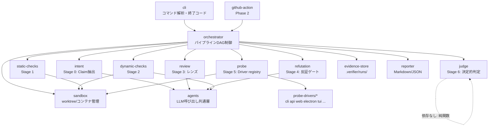
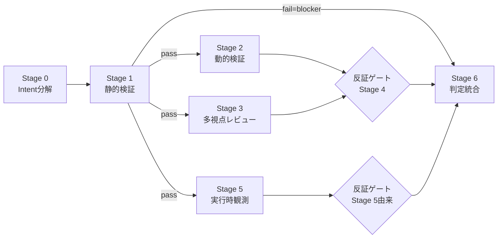
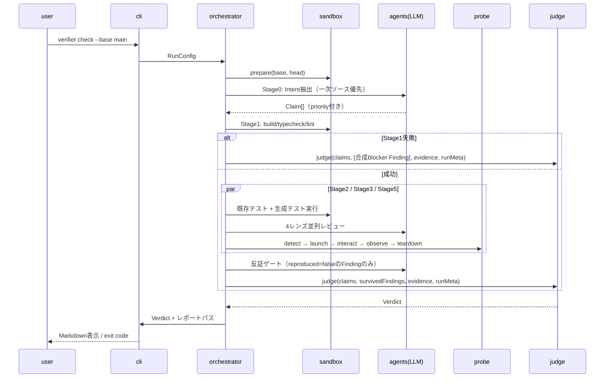

# Verifier 詳細設計書 (v0.1)

[SPEC.md](./SPEC.md) の要求を実装に落とすための設計文書。対象はPhase 1 (MVP) + Phase 2の骨格。Evalハーネスの詳細は [EVAL.md](./EVAL.md) を参照。

## 1. コンポーネント構成と依存関係



依存の原則:

- `judge`（Stage 6）は**純関数モジュール**。LLM・FS・ネットワークに依存せず、`(Claim[], Finding[], Evidence[], RunMeta) → Verdict` のみ（確信度のCheck強度は `Evidence.checkKind` の実績から取るためEvidenceが入力に必要）。単体テストで全分岐を網羅する。
- `agents` がLLM依存を一手に引き受ける。他モジュールはLLMを直接呼ばない（プロンプト契約とリトライ・コスト計測を一元化）。
- `probe-drivers/*` は `probe-sdk` にのみ依存する独立パッケージ。SDK公開（Phase 2）を見据え、コアの内部型をimportしない。
- ドライバとコアで共有するプリミティブ型（`TargetType`、`Scenario`、`Observation` 等）は **`probe-sdk` 側で定義し、`core` が再export** する（依存方向: core → probe-sdk。逆はなし）。

### パッケージ構成（モノレポ）

```
packages/
  core/            # orchestrator, judge, intent, review, refutation, types
  agents/          # LLM共通層（Claude Agent SDK ラッパ）
  sandbox/         # worktree / コンテナ / ネットワークポリシー
  probe-sdk/       # ProbeDriver インターフェース（公開API、依存ゼロ）
  probe-drivers/   # cli, api, web, electron, tui, ...（probe-sdkのみに依存）
  evidence/        # Evidence Store
  reporter/        # Markdown / JSON / GitHubコメント
  cli/             # bin: verifier
fixtures/          # EVAL.md参照（fixtureアプリ・コーパス）
```

## 2. データモデル（TypeScript型定義）

`packages/core/src/types.ts` の正本。verdict.schema.json（§3）はここから生成する（drift防止のため手書き二重管理をしない）。

```typescript
export type TargetType =
  | 'cli' | 'api' | 'web' | 'electron' | 'tauri'
  | 'macos-native' | 'windows-native' | 'tui' | 'mobile';

export type TrustLevel = 'trusted' | 'untrusted';

export type CheckKind =
  | 'runtime'   // Stage 5 実行観測 / 再現コード実行（強度 1.0）
  | 'test'      // テスト実行（0.9）
  | 'static'    // build/typecheck/lint（0.7）
  | 'reading';  // コードリーディング（0.5）

export type ClaimPriority = 'must-verify' | 'nice-to-verify';
export type ClaimStatus = 'verified' | 'failed' | 'unverified';

export interface Claim {
  id: string;                    // "C-1"
  statement: string;             // 「空配列を渡してもクラッシュしない」
  priority: ClaimPriority;
  source: IntentSource;          // どのIntentソースに由来するか
  plannedChecks: CheckKind[];    // 空配列 = 検証手段なし → unverified確定
  status: ClaimStatus;           // Stage 6で確定
  evidenceIds: string[];
}

export interface IntentSource {
  tier: 'primary' | 'secondary'; // primary=人間由来, secondary=生成エージェント由来。
                                 // tierはkindではなく「作成主体」で決まる: 人間が書いた
                                 // コミットメッセージは primary、botが書いたPR説明は
                                 // secondary。判別はauthor情報（botフラグ、Co-Authored-By、
                                 // S3連携の入力フィールド）による。判別不能時はsecondary
  kind: 'issue' | 'user-prompt' | 'spec-file' | 'pr-description' | 'commit-message';
  ref: string;                   // issue URL、ファイルパス等
}

export type FindingCategory =
  | 'security' | 'data-loss' | 'crash' | 'regression'
  | 'logic' | 'perf' | 'style'
  | 'observation';  // 問題ではないが判断材料になる観察（Intent不明瞭、一次ソース欠如、
                    // LLM出力不能等）。deriveSeverityで常にinfoになる

export type Severity = 'blocker' | 'major' | 'minor' | 'info';

export interface Finding {
  id: string;                    // "F-1"
  category: FindingCategory;     // LLMが出力
  reproduced: boolean;           // 決定的な再現Evidenceの有無
  severity: Severity;            // deriveSeverity()で導出。LLMは設定しない
  title: string;
  location?: { file: string; line?: number };
  scenario: string;              // 問題が起きる具体的シナリオ（必須・空文字禁止。
                                 // 例外: category='observation' のみ空文字可）
  claimIds: string[];            // このFindingがfailさせるClaim（なければ空配列）。
                                 // must-verify Claimを含み reproduced=true なら当該Claimをfailedにする
  evidenceIds: string[];
  refutation: RefutationResult;  // 反証ゲートの結果
  origin: 'stage0' | 'stage1' | 'stage2' | 'stage3' | 'stage5' | 'system';
  lens?: 'correctness' | 'security' | 'regression' | 'performance';
}

export interface RefutationResult {
  required: boolean;             // reproduced=true なら false
  attempted: boolean;
  outcome: 'survived' | 'refuted' | 'skipped';
  reproConfirmed?: boolean;      // refuterのreproCommandをorchestratorが実行し成功した場合true。
                                 // trueなら Finding.reproduced を true に更新し severity を再導出する
                                 // （「読解のみ」のFindingが反証過程で実証されると minor → major / blocker に昇格する）
  notes?: string;
  evidenceIds: string[];
}

export interface Evidence {
  id: string;                    // "E-1"
  kind: 'command-output' | 'test-result' | 'screenshot' | 'network-log'
      | 'console-log' | 'perf-trace' | 'code-reading' | 'llm-judgment';
  checkKind: CheckKind;
  summary: string;
  path: string;                  // .verifier/runs/<id>/evidence/E-1.* への相対パス
  reproducible: boolean;         // 再現コマンド/手順を含むか
  command?: string;              // 再現コマンド
}

export type VerdictKind = 'mergeable' | 'conditional' | 'not_mergeable' | 'inconclusive';
// 厳しさの全順序: mergeable < conditional < not_mergeable。
// inconclusive は順序外の別クラス（CLIのexit codeも別値2。--fail-on はこの順序で比較し、
// inconclusive は --fail-on inconclusive を明示した場合のみ失敗扱い）

export interface Verdict {
  schemaVersion: 1;
  kind: VerdictKind;
  confidence: number;            // 0–100（§4の式）
  conditions: string[];          // conditional時の解消条件
  claims: Claim[];
  findings: Finding[];           // survived のみ。refuted は report.discardedFindings へ
  discardedFindings: Finding[];  // 反証で破棄されたもの（透明性）
  evidence: Evidence[];
  run: RunMeta;
}

export interface RunMeta {
  runId: string;
  startedAt: string;             // ISO 8601
  baseRef: string;
  headRef: string;
  trustLevel: TrustLevel;
  stagesExecuted: number[];
  stagesSkipped: {
    stage: number;
    reasonCode: 'env-failure' | 'budget-exceeded' | 'user-excluded' | 'upstream-failed';
    reason: string;
  }[];
  targets: TargetType[];
  cost: { inputTokens: number; outputTokens: number; usd: number };
  durationMs: number;
}
```

### severity導出（純関数）

```typescript
export function deriveSeverity(f: Pick<Finding, 'category' | 'reproduced'>,
                               failedMustClaim: boolean): Severity {
  if (f.category === 'observation') return 'info';
  if (failedMustClaim) return 'blocker';
  const critical: FindingCategory[] = ['security', 'data-loss', 'crash', 'regression'];
  if (critical.includes(f.category)) return f.reproduced ? 'blocker' : 'major';
  if (f.category === 'logic' || f.category === 'perf') return f.reproduced ? 'major' : 'minor';
  return 'minor'; // style
}
```

`failedMustClaim` は「`f.claimIds` に must-verify Claimが含まれ、かつ `f.reproduced === true`」で判定する。反証ゲートで `reproConfirmed=true` が返った場合は `reproduced` を更新したうえでseverityを**再導出**する。

### Claim状態の確定（純関数・Stage 6冒頭）

```typescript
export function deriveClaimStatus(claim: Claim, survived: Finding[],
                                  evidence: Evidence[]): ClaimStatus {
  // failed: このClaimをfailさせる再現済みFindingが生き残っている
  if (survived.some(f => f.claimIds.includes(claim.id) && f.reproduced)) return 'failed';
  // verified: 実在するEvidenceがこのClaimに紐づいており、failさせるFindingがない
  const hasClaimEvidence = evidence.some(e => claim.evidenceIds.includes(e.id));
  if (hasClaimEvidence) return 'verified';
  return 'unverified';
}
```

**正の証拠のClaim紐付け規則**（orchestratorが各Stage完了時に適用。これがないと全Claimがunverifiedのままになる）:

| Check実行 | 紐付け規則 |
|---|---|
| Stage 1 static成功 | `plannedChecks` に `static` を含む全Claimに static Evidence を紐付け |
| Stage 2 既存テスト全パス | `plannedChecks` に `test` を含む全Claimに test Evidence を紐付け。※v1の意図的な単純化（無関係なテストで検証済み扱いになり得る）。Phase 2のカバレッジ差分導入後は「変更行に触れたテストが存在する」場合に限定する |
| Stage 3 レンズ読解 | lens-reviewer が返す `claimAssessments`（supported=true）のClaimに reading Evidence（§9） |
| Stage 5 シナリオ全stepパス | `Scenario.claimIds` のClaimに runtime Evidence |
| 生成テストパス（Phase 2） | test-generator の `targetClaim` に test Evidence |

### システム合成Finding / 合成Claim

LLM以外（Stage 0/1/2の決定的処理）が生成するFindingは以下の表に従う。**環境起因の失敗はFindingにしない**（envFailureとして扱う。次表の下段参照）:

| 事象 | category | reproduced | origin | 結果severity |
|---|---|---|---|---|
| build / typecheck / lint がコマンド実行に成功し非0終了（=コードの問題） | regression | true | stage1 | blocker |
| 既存テストの新規失敗 | regression | true | stage2 | blocker |
| secret scan検出 | security | true | stage1 | blocker |
| Intent不明瞭・一次ソース欠如・LLM出力不能 | observation | false | stage0/system | info |

| 事象 | 扱い |
|---|---|
| コマンドが**開始できない**（コマンド不在・依存解決失敗・インタプリタ不在） | Findingにせず `stagesSkipped` に理由コード `env-failure` で記録 |
| `envFailure` の導出 | ある must-verify Claim の `plannedChecks` がすべて `env-failure` でスキップされた場合に true |

一次ソースと二次ソースの**食い違い**（SPEC Stage 0）は、intent-extractorの `conflicts` 出力を observation Finding（info）として記録する。ただし判定への実質的な反映はFindingではなく、一次ソース由来のmust-verify Claimが `failed` / `unverified` になることを通じて行われる（実装と無関係な要求のClaimは検証されないため自然に`conditional`以下へ落ちる）。

**合成Claim**: **一次ソース由来のClaimが0件**の場合（一次ソース自体が存在しない場合を含む）、合成must-verify Claim `C-0:「変更の意図が一次ソースから特定できる」`（plannedChecks: []、つまりunverified確定）を必ず生成する。二次ソース（コミットメッセージ等）からClaimが抽出できてもC-0の生成は省略しない（生成者の自己申告だけでは`mergeable`に到達させない）。これにより (a) 確信度式の分母Σ(w)が0にならない、(b) 「説明のないdiff」が`mergeable`に到達しない（mustUnverified → `conditional`）ことを構造的に保証する。

### Verdict決定（純関数）

```typescript
export function decideVerdict(claims: Claim[], findings: Finding[],
                              runMeta: RunMeta): VerdictKind {
  const envFailure = hasEnvFailure(claims, runMeta.stagesSkipped); // 上表の導出規則
  const survived = findings.filter(f => f.refutation.outcome !== 'refuted');
  if (survived.some(f => f.severity === 'blocker')) return 'not_mergeable';
  if (claims.some(c => c.priority === 'must-verify' && c.status === 'failed'))
    return 'not_mergeable'; // deriveSeverityでblocker化されるため通常1行目で捕捉。防御的に明記
  if (envFailure) return 'inconclusive';
  const mustUnverified = claims.some(
    c => c.priority === 'must-verify' && c.status === 'unverified');
  if (survived.some(f => f.severity === 'major') || mustUnverified) return 'conditional';
  return 'mergeable';
}
```

## 3. verdict.schema.json

`packages/core/src/types.ts` から `ts-json-schema-generator` で生成し、`schemas/verdict.schema.json` としてコミットする。CIで「生成結果とコミット済みスキーマの一致」を検証する（drift検出）。ルート型は `Verdict`、`$id` は `https://github.com/kaizen-agents-org/verifier/schemas/verdict.schema.json`、`schemaVersion` フィールドで後方互換を管理する（破壊的変更時にインクリメント）。

## 4. 確信度算出式

確信度の意味は「**この判定がどれだけ強い証拠に裏づけられているか**（検証の網羅度×手段の強度）」であり、mergeableへの傾きではない。`not_mergeable` でも、blockerが実行で再現されていれば確信度は高くなる。

```
confidence = clamp(round(100 × Σ(w_i × s_i × v_i) / Σ(w_i)) − penalty, 0, 100)

w_i: Claim重み      must-verify = 2, nice-to-verify = 1
s_i: Check強度      そのClaimのEvidence（Evidence.checkKind）の実績最大強度
                    runtime = 1.0, test = 0.9, static = 0.7, reading = 0.5
v_i: 検証完了度     verified = 1, failed = 1（検証は完了している）, unverified = 0
penalty: survived Findingによる減点（判定根拠の不確かさを表す）
                    blocker = 15/件, major = 8/件, minor = 2/件, info = 1/件
```

- Σ(w) = 0 は合成Claim C-0（§2）により構造的に発生しないが、防御的に `claims.length === 0 → confidence 0` とする。
- 例（SPEC §6の出力例と同期）: must 3件 verified（C1: test=0.9、C2: テストパスを含むため test=0.9、C3: runtime=1.0）+ nice 1件 unverified
  = 100 × (2×0.9 + 2×0.9 + 2×1.0) / 7 = 80 − (major 8 + minor 2) = **70**
- 式の定数は `judge/constants.ts` で一元管理し、変更はEvalコーパスの全再実行を伴う（EVAL.md §5）。

## 5. パイプライン制御（Orchestrator）

### 実行DAG



- Stage 2 / 3 / 5 は**並列実行**（同一worktreeを読むが、実行系はStage間でポートとtmpを分離）。
- 反証ゲートは `refutation` モジュールの同一実装を2箇所から呼ぶ（`reproduced=true` のFindingはスキップ）。
- Stage 1失敗時はStage 2/3/5をスキップし、`stagesSkipped` に理由を記録して即Stage 6へ。

### シーケンス（`verifier check --base main`）



### 状態と再開

- 各Stageの完了時に `.verifier/runs/<id>/state.json` にチェックポイントを書く。`--resume <run-id>` で未完了Stageから再開（LLMコスト節約）。
- `--reuse-claims <run-id>` は state.json からStage 0の出力のみ読み込む。

## 6. Probe Driver SDK

`packages/probe-sdk`（依存ゼロの公開パッケージ）。

SDK境界は `ProbeDriver.launch()` が返す `ProbeSession` に寄せる。ドライバはターゲット検出・起動・セッション内部状態・操作実行・観測・終了処理を所有し、orchestratorは `detect → launch → session.interact → session.observe → session.teardown` を呼び出すだけにする。Finding化、差分判定、retry/fallback判断はorchestrator側の責務とし、ドライバは共通error型と観測結果だけを返す。

```typescript
export interface ProbeDriver {
  readonly targetType: TargetType;
  /** プロジェクトを検査して対応可否を返す。nullなら非対応 */
  detect(ctx: ProjectContext): Promise<DetectResult | null>;
  /** ターゲットを起動しセッションを返す。起動失敗はLaunchErrorをthrow */
  launch(ctx: LaunchContext): Promise<ProbeSession>;
}

export interface ProjectContext {
  rootDir: string;
  packageJson?: Record<string, unknown>;
  files: (glob: string) => Promise<string[]>;
  config?: ProbeConfig;          // verifier.config の probe セクション
}

export interface DetectResult {
  confidence: number;            // 0–1。複数ドライバが反応した場合は高い方
  launchHint: string;            // 起動方法の説明（例: "npm run dev → :5173"）
}

export interface LaunchContext {
  workdir: string;               // base or head のworktree
  env: Record<string, string>;
  ports: PortAllocator;          // 並列実行時の衝突回避
  timeoutMs: number;             // §SPEC 9 の時間予算から配分
  networkPolicy: NetworkPolicy;  // 許可リスト
}

export class LaunchError extends Error {
  readonly cause?: unknown;
  readonly retryable: boolean;
  constructor(message: string, options?: { cause?: unknown; retryable?: boolean }) {
    super(message);
    this.name = 'LaunchError';
    this.cause = options?.cause;
    this.retryable = options?.retryable ?? false;
  }
}

export interface ProbeSession {
  /** シナリオを実行。各stepの成否を返す */
  interact(scenario: Scenario): Promise<StepResult[]>;
  /** 現時点の観測を収集（interactと独立に何度でも呼べる） */
  observe(): Promise<Observation>;
  teardown(): Promise<void>;
}

export interface Scenario {
  id: string;
  description: string;           // 対応するClaim/フローの説明
  claimIds: string[];            // このシナリオが検証するClaim
  failCategory?: 'security' | 'data-loss' | 'crash' | 'regression' | 'logic' | 'perf';
                                 // シナリオ失敗時にFindingへ割り当てるcategory。
                                 // scenario-generatorがClaimの性質から設定（省略時は下表のデフォルト）
  steps: Step[];
}

/** ドライバ非依存の操作プリミティブ。非対応stepはUnsupportedStepErrorをthrowし、
    orchestratorはVision LLMフォールバック（screenshot + 自然言語指示）に切り替える */
export type Step =
  | { op: 'navigate'; url: string }
  | { op: 'click'; target: string }          // セレクタ/AXロール/座標はドライバが解釈
  | { op: 'type'; target: string; text: string }
  | { op: 'key'; keys: string }
  | { op: 'exec'; command: string; stdin?: string }
  | { op: 'request'; method: string; path: string; body?: unknown; headers?: Record<string,string>; expect?: RequestExpectation }
  | { op: 'wait'; forMs?: number; until?: string }
  | { op: 'assert-screen'; naturalLanguage: string };  // Vision LLM判定（反証必須Finding源）

export interface RequestExpectation {
  status?: number;                // 例: 認可必須APIは401を期待
  statusAnyOf?: number[];
  jsonSchema?: unknown;           // JSON Schema draft 2020-12互換。schema差分検出に使う
  bodyIncludes?: string;
  headers?: Record<string, string>;
}

export class UnsupportedStepError extends Error {
  readonly cause?: unknown;
  readonly retryable: boolean;
  readonly step: Step;
  constructor(step: Step, message: string, options?: { cause?: unknown; retryable?: boolean }) {
    super(message);
    this.name = 'UnsupportedStepError';
    this.step = step;
    this.cause = options?.cause;
    this.retryable = options?.retryable ?? false;
  }
}

export interface Observation {
  consoleErrors: LogEntry[];     // 新規/既存の区別はorchestrator側で差分化
  networkFailures: NetworkEntry[];
  screenshots: Artifact[];
  perf?: PerfMetrics;            // LCP/INP等。web系のみ
  exitCode?: number;             // cli/tui
  stdout?: string;
  stderr?: string;
  crashed: boolean;
  artifacts: Artifact[];         // HAR、トレース等
}

// ---- 補助型（すべてprobe-sdkで定義） ----
export interface StepResult { stepIndex: number; ok: boolean; error?: string; artifacts: Artifact[] }
export interface Artifact { kind: 'screenshot' | 'har' | 'trace' | 'log' | 'file'; path: string }
export interface LogEntry { level: 'error' | 'warn'; text: string; source?: string; timestamp: string }
export interface NetworkEntry { method: string; url: string; status?: number; failed: boolean }
export interface PerfMetrics { lcpMs?: number; inpMs?: number; raw?: Artifact }
export interface PortAllocator { acquire(): Promise<number>; release(port: number): void }
export interface NetworkPolicy { allowedHosts: string[] }
export interface ProbeConfig {
  launch?: string; readyWhen?: string; port?: number; scenarios?: Scenario[];
}
```

### Observation → Finding 変換規則（orchestrator側）

ベース環境との差分化（既存ノイズの除去）を行ったうえで、以下のデフォルトでFinding化する。シナリオに `failCategory` があればそれが優先される（例: 認可Claimのシナリオで期待401が200 → security）:

| Observation | category（デフォルト） | reproduced | 備考 |
|---|---|---|---|
| `crashed = true` | crash | true | |
| 新規 `consoleErrors` | logic | true | |
| 新規 `networkFailures` | logic | true | |
| `request` stepの期待ステータス/スキーマ不一致 | logic | true | failCategory指定が典型的に効く箇所 |
| `exitCode` / stdout / 生成ファイルの期待不一致（cli/tui） | logic | true | |
| `perf` の閾値超過劣化 | perf | true | |
| `assert-screen`（Vision LLM）のfail | logic | **false** | 反証必須（再実行 + 別プロンプト再判定） |
| シナリオ時間予算超過 | Findingにしない | — | 対応Claimを `unverified` へ（§10） |

実装規約:

- ドライバは**Findingを作らない**。観測（Observation）を返すだけで、Finding化と差分判定はorchestrator/judge側の責務（ドライバ実装者にルーブリックの知識を要求しない）。
- `detect` は副作用禁止（ファイル読み取りのみ）。
- ドライバ登録: 同梱は `probe-drivers/` から静的登録。サードパーティは `verifier.config` の `probe.drivers: ["@scope/verifier-driver-x"]` でnpmパッケージ名指定。

## 7. CLI仕様

```
verifier check [path]            # デフォルト: 作業ツリーの未コミット変更
  --base <ref>                   # 比較先（default: マージベース）
  --pr <number>                  # GitHub PR（gh CLI経由で取得）
  --intent <ref>                 # issue#45 | ファイルパス | 文字列（複数指定可・一次ソース扱い）
  --stages <list>                # 実行Stage（default: 0,1,2,3,4,5）。指定対象は0–5で、
                                 # Stage 6（判定統合）は常時実行（除外するとVerdictが
                                 # 出力できないため指定不可）
                                 # 4（反証ゲート）を除外した場合、反証必須のFinding
                                 # （reproduced=false）はseverity導出をスキップし
                                 # info に降格して判定に影響させない
  --json                         # VerdictのJSONをstdoutへ（人間向け出力はstderrへ）
  --reuse-claims <run-id>        # Claimセット固定再実行
  --resume <run-id>              # チェックポイントから再開
  --trust <trusted|untrusted>    # default: trusted。untrusted+コンテナ未整備なら実行系skip
  --budget-minutes <n>           # 全体時間予算（default: 30）
  --fail-on <verdict>            # exit code 1 にする閾値（default: not_mergeable）

verifier report <run-id>         # 過去runのレポート再表示
verifier runs                    # run一覧
```

終了コード: `0` = `--fail-on` 閾値未満 / `1` = 閾値以上（not_mergeable等） / `2` = inconclusive / `64` = 設定・引数エラー / `70` = 内部エラー。

### verifier.config.{json,ts} スキーマ（主要キー）

```typescript
export interface VerifierConfig {
  commands?: { build?: string; test?: string; lint?: string; typecheck?: string };
  trust?: TrustLevel;
  confidence?: { failOn?: VerdictKind };
  probe?: {
    targets?: Partial<Record<TargetType, { launch: string; readyWhen?: string; port?: number }>>;
    scenarios?: Scenario[];      // 明示シナリオ（自動生成に追加）
    drivers?: string[];          // サードパーティドライバ
    enabled?: boolean;           // default: true
  };
  network?: { allow?: string[] };  // 許可リスト追記（レジストリ/localhost/LLM APIは常時許可）
  llm?: { model?: string; maxBudgetUsd?: number };
}
```

## 8. Evidence Store レイアウト

```
.verifier/
  runs/
    2026-06-12T0930-a1b2c3/
      state.json          # チェックポイント（Stage単位）
      verdict.json        # Verdict（schema準拠）
      report.md           # 人間向けレポート
      claims.json         # Stage 0出力（--reuse-claims対象）
      evidence/
        E-1.txt           # コマンド出力
        E-2.png           # スクリーンショット
        E-3.har           # ネットワーク記録
      meta.json           # RunMeta
  cache/                  # ベース環境のビルドキャッシュ
```

`.verifier/` はデフォルトで `.gitignore` 追記を提案する（初回実行時）。

## 9. agents層（LLMプロンプト契約）

すべてのLLM呼び出しは構造化出力（JSON Schema強制）で行い、自由文の解析をしない。

| エージェント | 入力 | 出力スキーマ（要点） |
|---|---|---|
| intent-extractor | Intentソース（tier付き）+ diff要約 | `{ claims: {statement, priority, plannedChecks, sourceRef}[], conflicts: string[] }` |
| lens-reviewer ×4 | diff + 周辺コード + レンズ定義 + Claim一覧 | `{ findings: {category, title, location, scenario, suggestedRepro?, claimIds}[], claimAssessments: {claimId, supported, note}[] }` ※severityフィールドは存在しない。claimAssessmentsは正の証拠（reading強度）の紐付けに使う |
| test-generator | 変更関数のシグネチャ + 既存テスト例 | `{ tests: {name, code, targetClaim?}[] }` |
| refuter | Finding + 関連コード + 実行権限 | `{ outcome: 'survived'\|'refuted', reasoning, reproCommand? }` |
| scenario-generator | diff + 検出ターゲット + Claim | `{ scenarios: Scenario[] }` |
| vision-judge | スクリーンショット + 自然言語アサーション | `{ pass: boolean, observation: string }` |

共通規約: temperature等の生成パラメータ・モデルIDは `agents/config.ts` で固定しrunMetaに記録（再現性）。リトライはスキーマ不一致時のみ最大2回。トークン・コストを呼び出し単位で計測し `RunMeta.cost` に集計。

## 10. エラーハンドリング方針

| 事象 | 扱い |
|---|---|
| Stage実行不能（環境構築失敗、コマンド不在） | Stageを`skipped`にし理由を記録。must-verify Claimの検証手段が全滅した場合のみ`inconclusive` |
| Probe起動失敗 | そのターゲットを「未観測」とし、対応Claimは`unverified`へ。リトライ1回 |
| シナリオ時間予算超過 | シナリオ中断 → `unverified`。Findingにしない（flaky源を判定に入れない） |
| LLMスキーマ不一致（リトライ後も） | そのエージェントの出力を空として続行し、infoのFindingで明示 |
| LLM API障害 | チェックポイントを書いてexit 70。`--resume`で再開可能 |
| 予算超過（--budget-minutes / maxBudgetUsd） | 残Stageをskipped化して即Stage 6（部分結果で判定、確信度に反映） |
